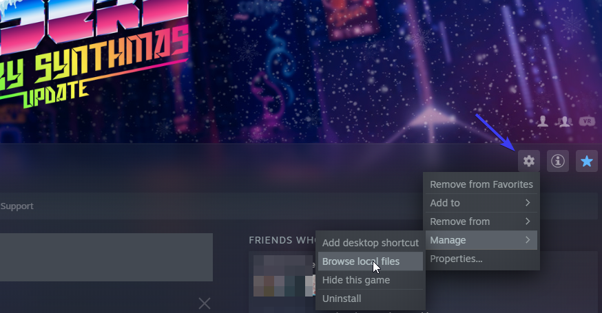
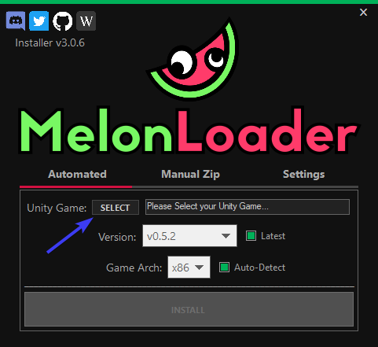

# How To Install Custom Mods

> A Step-By-Step Guide to get Synthriders ready for mods!

# About Synth Riders Modding

While Synth Riders used to have official modding support, it has been awhile since we have seen any progress towards it's return.  
Therefore, currently Mods are installed using [MelonLoader](https://melonwiki.xyz).

This guide will lead you step-by-step on how to install the MelonLoader for Synth Riders **PCVR**.

## How To Install MelonLoader

> **Install mods at your own risk**  
> Before continuing, it is highly advised to back up your custom content to make sure you won't have to redownload it again in case something goes wrong or breaks!

### Requirements

In order to run the **Automated Installer** and **MelonLoader** you must have [.NET 6.0](https://dotnet.microsoft.com/en-us/download/dotnet/6.0#runtime-desktop-6.0.19) installed.  
In order to run **MelonLoader** you must install [Microsoft Visual C++ 2015-2019 Redistributable 64 Bit](https://aka.ms/vs/16/release/vc_redist.x64.exe).

### 1. Download the Installer

There are two ways of installing MelonLoader. In this guide, we will use the Installer.  
Go ahead and [download the latest release here.](https://github.com/LavaGang/MelonLoader.Installer/releases/latest/download/MelonLoader.Installer.exe)

### 2. Locate your Synth Riders Installation

- Open the page for Synth Riders in your Steam Library

- Click the settings icon and navigate to `Manage->Browse local files`  
  

- Now copy the path to your Synth Riders directory or remember it for the next steps!

### 3. Install MelonLoader

- Open the MelonLoader Installer and select your Unity game (in our case, **Synth Riders**)  
  

- Navigate to your Synth Riders installation directory which we found in the previous section
- Select `SynthRiders.exe`
- Start with Version `v0.6.2` and update to the latest version if you encounter any issues ([source](https://github.com/bookdude13/SRModCore/releases/tag/v2.0.0))
- Click **Install**!

> You successfully installed **MelonLoader** for Synth Riders and are ready to install some mods!  
> Downloaded mods (`.dll`) can be copied into the `SynthRiders/Mods` folder and they will be loaded the next time you start the game!  
**You can find a list of released mods [here](/modding/released-mods/)**
