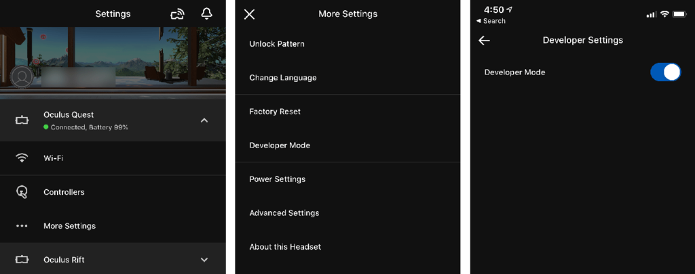
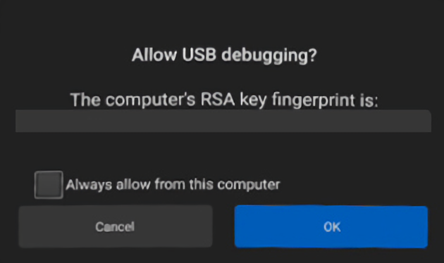

# Quest Setup Guide

> Initial setup required for installing custom content on Quest

The following steps are **required** to prepare your Quest device for installing custom content.

_This is a one time process._

## Enable Developer Mode

To be able to put any custom content on the Quest you will first need to register as an Oculus developer. This process is free and can be easily done by following these steps:

1. Go to [**_dashboard.oculus.com_**](https://dashboard.oculus.com) and create a **New Organization**.
2. Install and open the **Oculus App** on your smartphone
3. Turn on the Quest and connect to it through Bluetooth
4. Click on **Settings > Oculus Quest > More Settings > Developer Mode** then enable the Developer Mode
5. If you have set up a unlock pattern you need to disable it under**Settings > Oculus Quest > More Settings > Unlock Pattern**
6. Restart the Quest

## Install Oculus ADB Drivers

!> **Windows Only**
This step is required for Windows PC's

Install the **Oculus ADB drivers** on your PC. You can download them from [**_developer.oculus.com_**](https://developer.oculus.com/downloads/package/oculus-go-adb-drivers/)

## Connect Your Quest

1. Connect the Quest with a USB Cable
   _If you are having trouble in later steps, try out different cables_.
2. Now you should see the **Allow USB Debugging** message in the Quest headset
3. From inside the Quest headset, select **Always allow from this computer** and hit **OK**

   You will then get a **second** permission request on the Quest to allow the PC to access the headset which you will also need to allow.

