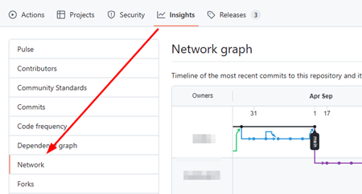

# Released Mods and Tools

A list of mods and tools to improve your experience with SynthRiders.

## Mods

> Before you can start adding these mods to your game, you have to install MelonLoader first. Check out our guide [here](/installing-custom-content/pcvr/installing-mods/).

If you already have MelonLoader set up, just drag & drop the respectable .dll-file of the mod into your Mods directory.

!> Due to changes to the Game in September 2024, many older mods on GitHub are not working anymore.

Always check out the date of the latest release and check the out the network graph for updated forks:  

### Where to find Mods

- Search GitHub for Tags: `synthriders`: https://github.com/topics/synthriders
- Search GitHub for Tags: `synthriderz`: https://github.com/topics/synthriderz
- Check out the modding community: [https://discord.synthriderz.com](https://discord.synthriderz.com)

### Popular Mods

Below a list of popular mods for Synth Riders(that should still work as of March 2025).

- SRModCore
    - Core shared functions to make modding Synth Riders easier
    - https://github.com/bookdude13/SRModCore/releases
- SynthRiders-Websockets-Mod
    - Allows to receive updates about the game via Websocket
    - https://github.com/bookdude13/SynthRiders-Websockets-Mod/releases
- SRPerformanceMeter
    - Adds an additional panel to the end game screen showing various statistics.
    - https://github.com/bookdude13/SRPerformanceMeter/releases
- SRVoting
    - A Synth Riders mod for in-game up/down vote of custom songs
    - https://github.com/bookdude13/SRVoting
- SRPlaylistManager
    - Mod for SynthRiders for enhancing playlist management (adding, removing, etc)
    - https://github.com/bookdude13/SRPlaylistManager/releases
- Trashbin
    - Delete song button mod for Synth Riders
    - https://github.com/bookdude13/Trashbin/releases

## Tools

- [Synth-Riders-DiscordRPC](https://github.com/6uhrmittag/Synth-Riders-DiscordRPC)
    - Discord Rich Presence for Synth Riders
- [RailGrinder](https://github.com/tommaier123/RailGrinder)
    - A proof of concept tool for statistical score chasing in SynthRiders
    - Version v1.2.0: [Download from GoogleDrive](https://drive.google.com/file/d/1ys8XtL0sWSaq54W4TmrjPeWBpw8yt0Uz/view?usp=drive_link) (see Discord for details: [link](https://discord.com/channels/546769414226182202/546867101688791053/1332468376827854930))
- [NoodleManagerX](https://github.com/tommaier123/NoodleManagerX/releases)
    - Desktop application for installing custom songs to Quest and PCVR
- [SynthRidersPlus](https://github.com/hardcpp/SynthRidersPlus)
    - Twitch & YouTube integration
- [Custom Synth Riders platform](https://vrflad.com/synthriders/)
    - Image to custom Decal converter

## Additional Resources

- [How to install Custom Mods](/installing-custom-content/pcvr/installing-mods/)
- [Getting started with Modding](/modding/getting-started/)
